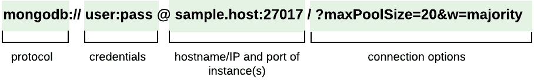

# task-manager

## Keys

La herramienta de línea de comandos OpenSSL se utiliza para generar las claves. Para generar la clave privada, ejecute el siguiente comando en la ventana de la línea de comandos:
```console
openssl genrsa -out app.rsa 1024
```
Este comando genera una clave de 1024 bits llamada app.rsa. Para generar una clave pública equivalente a la clave privada, ejecute el siguiente comando en la ventana de la línea de comandos:
```console
openssl rsa -in app.rsa -pubout > app.rsa.pub
```
Este código genera una clave pública equivalente denominada app.rsa.pub. Las claves RSA se almacenan en el directorio `keys`.

## Instalar MongoDB driver
```console
go get go.mongodb.org/mongo-driver/mongo
```
> Nota: Revise la documentación oficial.

## Mongo URI
